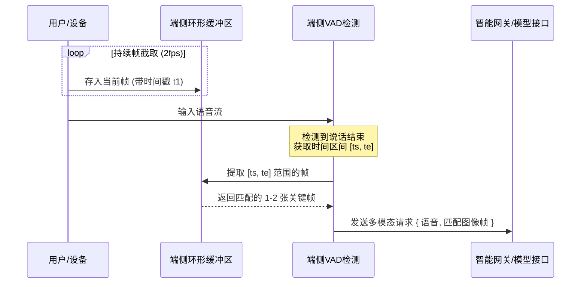

# AI 视觉对话助手：四大核心维度深度解析与技术设计

针对**AI 视觉对话助手（课题一）**，要实现真正惊艳的“WOW 效果”和生产级性能，必须在**音视频协同**、**波动式响应（双工对话）**、**端侧轻量化识别**以及**多模型协同路由**这四个核心技术维度上进行深度的方案设计。

以下是针对这四个维度的深度解析与具体的技术实现方案：

---

## 维度一：音视频协同 (Audio-Video Coordination & Alignment)

音视频协同的核心挑战在于**“时空对齐”**：当用户说 *“看看我手里的这个东西，它有什么用？”* 时，系统如何确保发送给大模型的视频帧，正是用户说 *“这个东西”* 时的那一帧，而不是因为网络延迟滞后或超前的画面。

### 1. 核心设计方案
* **时间戳滑窗缓存（Timestamped Ring Buffer）**：
  - **端侧机制**：前端 Canvas 在后台以固定频率（例如 2fps）持续截取摄像头画面，并将图片转换为低分辨率的 Base64 编码，存入一个环形队列（Ring Buffer），每个元素标记其捕获的时间戳（`capture_time`）。
  - **语音关联**：当语音检测（VAD）判定用户说话结束时，获取该句语音的起点时间戳（`speech_start`）和终点时间戳（`speech_end`）。
  - **时空对齐发送**：从环形队列中筛选出落入 `[speech_start, speech_end]` 区间内的关键视频帧（通常 1~2 帧即可），与音频数据/文本一起打包发送给大模型。
* **双通道合成流式传输 (RTC Pipeline)**：
  - 如果采用更先进的 Live 模式（如 Gemini Multimodal Live API），直接通过 WebRTC 建立音视频双路轨道，由大模型服务端的实时网关在底层进行帧与音频流的时序对齐。



---

## 维度二：波动式响应与双工对话 (Duplex Dialogue & Dynamic Streaming)

传统的“用户说完 -> 等待 -> AI 回答”是单工（Half-Duplex）交互，显得呆板。波动式响应（Full-Duplex）要求系统像真人一样，**能够实时流式响应，且允许随时“被打断”**。

### 1. 核心设计方案
* **首字延迟优化（TTFT - Time to First Token）**：
  - **流式音频合成 (TTS Streaming)**：后端 LLM 生成文本的同时，通过 SSE (Server-Sent Events) 或 WebSocket 实时流式传输文本给 TTS 引擎，TTS 引擎同样以音频流块 (Audio Chunks, 如 PCM/OPUS 格式) 传回前端。
  - **前端播放器缓冲 (Audio Queue)**：前端使用 `Web Audio API` (通过 AudioWorklet 或 SourceBuffer) 接收流式音频块并连续播放，实现“边生成边朗读”，将首字延迟控制在 1 秒以内。
* **双向打断机制（Bi-directional Interruption）**：
  - **端侧快速打断**：前端在播放 AI 音频的同时，本地的轻量级 VAD 依然保持运行。一旦检测到用户开始说话（`user_started_speaking`）：
    1. **立刻停止（Mute）**当前正在播放的网页音频。
    2. **清空播放队列**，重置音频上下文。
    3. 向后端发送一个 **`interrupt` 信号**，让网关立即中止当前的 LLM 生成和 TTS 合成，防止云端继续计费。

---

## 维度三：本地基础小模型识别 (Local Edge-AI Preprocessing)

多模态大模型的 API 费用极其昂贵，如果把所有的摄像头画面和环境噪音都源源不断送往云端，成本将呈指数级上升。**本地小模型是实现“端侧过滤与智能决策”的关键。**

### 1. 核心设计方案
* **端侧 VAD（语音活动检测）**：
  - 引入 `onnxruntime-web` 在浏览器运行 **Silero VAD** 小模型，或利用 Web Audio API 分析音频能量门限。
  - **作用**：完全在本地过滤掉环境白噪音和静音段，仅在检测到人声时触发语音处理，成本降为 0。
* **端侧视觉变化检测（Difference Detection & Motion Detection）**：
  - 使用 Canvas 像素操作（如 ImageData 对比）计算前后帧的差异率；或者利用轻量级端侧模型（如 TensorFlow.js 驱动的 MobileNet/YOLO-nano）。
  - **作用**：如果画面在过去几秒内没有显著变化（比如相机静止对着桌面），大模型仅需要接收**第一帧和文字**，后续交互自动降级为“纯文字”或“重用缓存帧”模式，从而省去大量重复的视觉 Token 消耗。
* **本地唤醒词识别 (Wake Word)**：
  - 本地运行超轻量级神经网络检测特定唤醒词（如 “Hi, Assistant”），唤醒前不产生任何云端流量。

---

## 维度四：多模型协同识别与智能路由 (Multi-Model Collaborative Routing)

对于用户的请求，一味地使用最贵的模型（如 GPT-4o 或 Gemini 1.5 Pro）是不经济的。必须建立**智能路由网关**，根据任务类型动态分流。

### 1. 核心设计方案
* **分级路由机制 (Tiered Routing)**：
  - **Tier 1 (本地解析/轻量模型)**：
    * 比如用户说 *“把界面调亮一点”* 或 *“帮我记下这个待办事项”*。
    * **处理**：本地 ASR 转化为文本后，直接通过前端或轻量级本地规则匹配/本地小模型处理，不调用云端 LLM。
  - **Tier 2 (极速多模态模型 - Flash/Mini)**：
    * 适用于日常闲聊、物品识别、实时问答。
    * **处理**：路由至 `Gemini 2.5 Flash` 或 `GPT-4o-mini`。速度极快（延迟 < 500ms），成本仅为高级模型的 1/10。
  - **Tier 3 (高推理/大上下文模型 - Pro/Reasoning)**：
    * 适用于复杂的逻辑分析、代码审查、数学解题。
    * **处理**：当 Tier 2 模型返回 `EXECUTE_ESCALATION` 信号，或者端侧检测到用户展示了复杂媒介（如代码截屏、试卷）时，自动路由至 `Gemini 1.5 Pro` 或 `Claude 3.5 Sonnet`。
* **视觉-文本解耦流水线 (Separated Pipeline)**：
  - 针对带有文本的视觉场景（如书本、屏幕），先调用云端极便宜的 OCR 服务或端侧 OCR，将提取出的文字注入 Prompt，然后以纯文本形式调用 LLM，避免将整张高分辨率图片送入大模型，节省 90% 的图像 Token 费用。

---

## 四大维度集成架构图

```
+--------------------------------------------------------------------------------+
|                                  前端浏览器 (Client)                            |
|  +------------------+     +--------------------+     +----------------------+  |
|  |   摄像头视频流   |     |    麦克风音频输入  |     |  Web Audio 实时播放  |  |
|  +--------+---------+     +----------+---------+     +----------^-----------+  |
|           |                          |                          |              |
|     [Canvas 捕获]                    |                          |              |
|           |                     [本地VAD检测]             [流式音频队列]       |
|           v                          v                          |              |
|  +------------------+        /---------------\                  |              |
|  | 端侧视觉过滤     |        | 是否检测到声音? |                  |              |
|  | (差异率/ONNX检测)|        \-------+-------/                  |              |
|  +--------+---------+                | 是                       |              |
|           |                          v                          |              |
|           |                 +----------------+                  |              |
|           +---------------->| 画面&音频对齐包|                  |              |
|                             +--------+-------+                  |              |
+--------------------------------------|--------------------------|--------------+
                                       | WebSocket/HTTP           | Audio Stream
                                       v                          |
+-----------------------------------------------------------------|--------------+
|                                智能网关 (Backend)               |              |
|   +----------------------------------v-----------------------+  |              |
|   | 智能路由中心 (Router)                                     |  |              |
|   |  - 简单控制指令 -> 本地/内存响应                          |  |              |
|   |  - 闲聊与一般识别 -> 路由至 Gemini Flash (极速、便宜)     |  |              |
|   |  - 深度逻辑推理 -> 路由至 Gemini Pro (高级推理)          |  |              |
|   +----------------------------------+-----------------------+  |              |
|                                      |                          |              |
|                                      v                          |              |
|                       +--------------+---------------+          |              |
|                       |   多模态大模型 (Gemini API)   +----------+              |
|                       +------------------------------+                         |
+--------------------------------------------------------------------------------+
```
