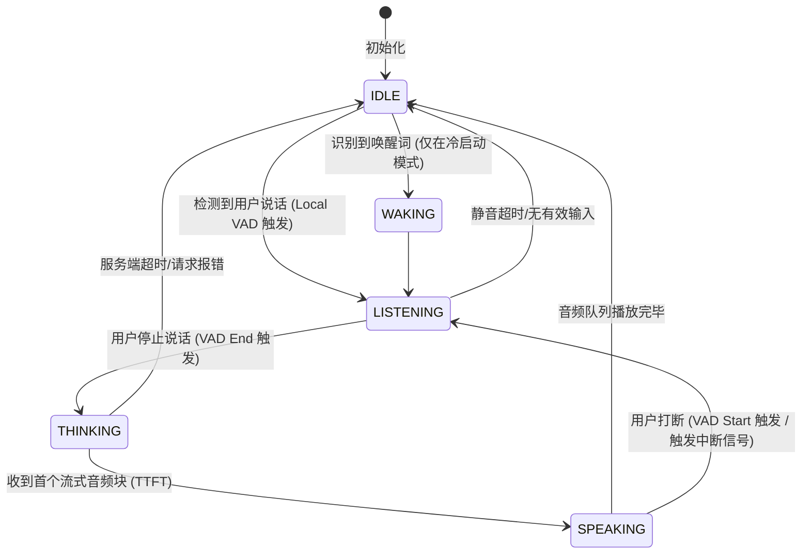

# AI 视觉对话助手：双工状态机、网络协议与非言语交互设计

为了让**AI 视觉对话助手（课题一）**在各种复杂的网络环境和长对话场景中表现出如真人般的流畅度与鲁棒性，我们需要在系统设计上引入**状态机管理**、**网络通信协议优化**、**非言语反馈（Backchanneling）**以及**弱网降级策略**。

以下是针对这四个维度的系统级深度设计方案：

---

## 1. 客户端多模态双工状态机 (Full-Duplex State Machine)

在流式输入、流式输出、实时打断的多模态交互中，客户端的界面表现和逻辑极易发生“状态混乱”（例如：AI 正在播放上一句的尾音，却已经开始录制下一句的输入）。因此，必须设计一套**严谨的有限状态机 (FSM)**。

### 状态定义与迁移逻辑

* **IDLE（空闲态）**：摄像头保持预览，但画面不外传；麦克风开启，仅本地 VAD 监听能量值。
* **LISTENING（倾听态）**：开始向环形缓冲区写入视频帧，并流式缓存用户音频，准备上传。
* **THINKING（思考态）**：停止音频录制，向云端发送打包好的多模态数据，等待大模型生成。界面上波形图显示“思考中”呼吸动画。
* **SPEAKING（发声态）**：流式音频队列开始解码并播放，实时波形图随着 AI 说话跳动。如果本地 VAD 再次触发，立即**强转为 LISTENING 态**并执行打断协议。

---

## 2. 通信协议选型：WebSocket vs HTTP POST/SSE vs WebRTC

音视频双工对话中，高频的双向控制指令（如打断、进度回执）和媒体流传输，对网络协议提出了极高的要求。

### 协议比选矩阵

| 评估维度 | HTTP POST + SSE (流式接收) | WebSocket (双向长连接) | WebRTC (实时媒体网络) |
| :--- | :--- | :--- | :--- |
| **实时性/延迟** | 中等（数百毫秒） | 佳（100-200毫秒） | 极佳（100毫秒以内） |
| **双向传输能力** | 单向（服务器流式推给客户端） | 双向对等（可同时传输音频和控制指令） | 双向音视频轨道流式传输 |
| **打断机制实现** | 较难（打断需要发起新的 HTTP 请求取消之前的 Response） | 极易（直接在 Socket 中发送一个 `interrupt` 控制帧） | 极易（通过 DataChannel 或轨道静音） |
| **实现与调试难度**| 简单，符合常规 Web 开发 | 中等，需要建立连接维持和保活逻辑 | 极高，需要搭建 STUN/TURN 穿透服务及信令服务器 |

### 💡 深度设计：混合协议架构 (Hybrid Protocol)
对于中小型项目，我们推荐使用 **WebSocket 作为主干通信协议**：
* **音频与文本传输**：将麦克风采集的音频数据分块（PCM/Opus）直接作为二进制帧通过 WebSocket 发送；AI 生成的音频和控制回执也通过 WebSocket 传回。
* **控制指令（打断/进度回执）**：发送文本 JSON 帧（如 `{"type": "control", "action": "interrupt", "offset": 12}`）。
* **图像传输（图片帧）**：当需要发送视觉上下文时，将 Canvas 中的 Base64/Blob 图像帧作为二进制帧在 Socket 中插入，完成对齐。

---

## 3. 非言语反馈与微表情动效 (Non-Verbal Backchanneling & Aesthetics)

真人对话中，听者在对方说话时会通过“嗯”、“啊”、点头等**非言语反馈（Backchanneling）**来表示自己正在听，或者在思考时发出“呃……”的声音。这可以极大缓解人机交互中的“死寂感”。

### 💡 落地设计方案：
* **本地瞬时反馈音（Immediate Acknowledgement）**：
  - 当本地 VAD 检测到用户结束说话时，前端在发送数据的**瞬间**播放一个极轻的提示音（或气泡微弱收缩动效），给用户“系统已收到”的即时心理反馈，消除等待模型响应期间的焦虑。
* **AI 伴随式背道回应 (Acoustic Backchanneling)**：
  - 如果大模型推理耗时较长（如调用 Tier 3 Pro 模型），网关可以在收到请求的 200ms 内，先下发一个预制好的、极短的语气词音频（如“*嗯……*”或“*让我想想……*”），同时后端并行加载大模型。这能让首字感知延迟（Perceived Latency）降到几乎为 0。
* **UI 微表情动效 (Micro-animations)**：
  - **思考动效**：波形图从剧烈跳动收敛为平缓的 HSL 渐变呼吸光圈。
  - **视线对齐（Eye-contact Simulation）**：摄像头画面中，当检测到人脸时，UI 指示器上的“AI虚拟眼球”朝人脸中心点轻微偏转，增强交互真实感。

---

## 4. 弱网与离线容灾降级策略 (QoS & Offline Resilience)

无线网络（如移动 5G/Wi-Fi 切换）经常出现带宽抖动，必须确保系统在恶劣网络下不会崩溃。

### 💡 服务质量 (QoS) 降级方案：
1. **自动调频调质（Dynamic Adaptation）**：
   - 客户端实时监控 WebSocket 往返延迟 (RTT)。
   - **良好网络 (RTT < 150ms)**：发送 512x512 JPEG 图像，保持 2fps；音频使用高音质 Opus。
   - **一般网络 (RTT 150~500ms)**：降低图像分辨率至 320x320，降低频率至 0.5fps（每两秒发送一帧）。
   - **极差网络 (RTT > 500ms)**：自动进入 **“视觉挂起”模式**，停止自动传输摄像头帧。直到用户主动提及“*你看我这个……*”时，端侧合成提示音“*网络不佳，我正在尝试捕获一张静态照片，请保持相机稳定*”，改用单张截图上传。
2. **离线容错 (Offline Mode)**：
   - 当完全断网时，不向服务器发送数据，而是由本地 Service Worker 拦截请求，并通过端侧本地轻量级 TTS 朗读友情提示：“*网络连接已中断，我们暂时无法对话，请检查您的 Wi-Fi 设置。*”

---

## 🚀 本阶段分析总结

目前我们已经从**核心评估、进阶技术瓶颈、双工系统工程**三个维度完成了全面深度的技术研讨。这三份文档构成了您进行项目开发及提交设计文档的黄金素材：

1. 📊 [对比与评估报告](file:///d:/Users/Gwen317/Desktop/个人/study/ai_topics_comparison/comparison.md)：解答选题比对及成本控制宏观策略。
2. 🔬 [进阶难点方案](file:///d:/Users/Gwen317/Desktop/个人/study/ai_topics_comparison/vision_assistant_advanced_scenarios.md)：突破记忆分叉、AR 画布渲染等高级 Agent 交互难点。
3. ⚙️ [系统双工协议](file:///d:/Users/Gwen317/Desktop/个人/study/ai_topics_comparison/vision_assistant_protocol_and_state.md)：设计状态机、通信协议和用户交互的微表情动效。
