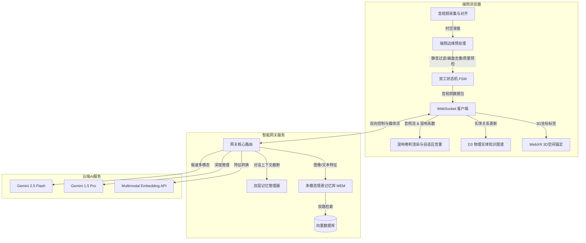

# AI 视觉对话助手：系统设计与创新方案全景蓝图 (V1.0)

本项目致力于开发一款具备**实时环境感知、双工语音对话、情景记忆与 AR 标注**能力的 AI 视觉对话助手。本蓝图已将所有的工程基础设计与四大核心技术创新点完全融合，作为项目的总设计方案与实施规范。

* **详细数据结构与数据库表结构规程**：详见 [系统核心设计与创新特性数据规程规范.md](file:///d:/Users/Gwen317/Desktop/个人/study/ai_topics_comparison/系统核心设计与创新特性数据规程规范.md)


---

## 一、 系统架构全景图

系统整体分为**端侧（Client）**、**网关层（Gateway）**和**多模态云服务（Cloud AI Services）**三个层次，核心模块及调用关系如下：



---

## 二、 核心模块与创新设计规范

### 1. 双向全双工通信与记忆分叉预防
* **基础设计**：基于 WebSocket 传输流式媒体与 JSON 控制信令。客户端 VAD 触发时立即通过 Socket 发送 `interrupt` 控制帧强行终止云端大模型和 TTS 生成。
* **分叉预防**：客户端播放音频时计算字词时间戳偏移量（Offset），打断时上报给网关，由网关在后台 [Memory.java](file:///d:/Users/Gwen317/Desktop/个人/study/src/main/java/com/study/agent/core/Memory.java) 对上一轮回复进行物理截断，防止端云记忆不一致。
* **设计详见**：[3_双工状态机与WebSocket协议设计.md](file:///d:/Users/Gwen317/Desktop/个人/study/ai_topics_comparison/design_details/3_双工状态机与WebSocket协议设计.md)

### 2. 端侧边缘预处理与主动质量引导
* **基础设计**：浏览器端 Wasm 运行 Silero VAD 过滤环境杂音；Canvas 进行帧差计算，无变化时不发送图像帧。
* **主动质量引导 (创新点)**：本地实时运行 Laplacian 模糊度检测和直方图亮度检测。若图像运动模糊或过暗，前端本地 TTS 直接语音提醒用户（“请把手拿稳，并开一下灯”），避免向云端发送垃圾图像，极大降低无效 Token 损耗。
* **设计详见**：[1_音视频基础维度深度解析.md: 维度三](file:///d:/Users/Gwen317/Desktop/个人/study/ai_topics_comparison/design_details/1_音视频基础维度深度解析.md)

### 3. 多模态长程情景记忆系统 (Episodic Memory - 核心创新点)
* **核心机制**：每次对话结束时，将用户展示的物品通过 Multimodal Embedding（如 CLIP）转化为 512 维视觉向量，与对话语义的 Text Embedding 一起存入向量数据库，生成“情景记忆卡片”。
* **双路检索**：用户指着东西说“*这个和前天看的一样吗*”时，网关融合视觉相似度与语义相似度进行双路匹配，召回历史卡片信息重注回 LLM 的 System Prompt，使 AI 具备跨越时空的记忆与对比能力。
* **设计详见**：[4_多模态长程情景记忆系统设计.md](file:///d:/Users/Gwen317/Desktop/个人/study/ai_topics_comparison/design_details/4_多模态长程情景记忆系统设计.md)

### 4. 听觉混响卷积与噪音自适应 (Acoustic Matching - 核心创新点)
* **声学模拟**：客户端通过 Web Audio API 分析麦克风输入的声学参数（如混响时间 RT60）。将 AI 的 TTS 语音通过 `ConvolverNode` 进行卷积处理，使其声音与用户当前房间（如浴室、客厅）融为一体。
* **伦巴德效应自适应**：在嘈杂环境下，系统根据麦克风检测到的环境声压自动提升播音音量，并利用滤波器微幅提高语音的中高频频率，使用户在不需要手动调音的情况下听清 AI 发音。
* **设计详见**：[5_混响同步与拓扑图谱创新设计.md: 创新点一](file:///d:/Users/Gwen317/Desktop/个人/study/ai_topics_comparison/design_details/5_混响同步与拓扑图谱创新设计.md)

### 5. D3 物理环境实体图谱 (Entity Graph - 核心创新点)
* **记忆拓扑化**：系统将对话中识别出来的所有物理设备、工具、电子元器件动态增加为 `D3.js` 节点，并根据用户的交互操作连接关系边。用户可以随时点击节点，在悬浮层中查看当时截取的物体图像与 AI 的历史分析日志。
* **设计详见**：[5_混响同步与拓扑图谱创新设计.md: 创新点三](file:///d:/Users/Gwen317/Desktop/个人/study/ai_topics_comparison/design_details/5_混响同步与拓扑图谱创新设计.md)

---

## 三、 V1.0 技术栈选型

* **前端 (Client)**：Vite + React + TypeScript + Web Audio API + Vis.js/D3.js + `@ricky0123/vad-web`
* **后端网关 (Gateway)**：Node.js (Express + Socket.io) / 或 Java (Spring Boot + WebSockets) 
* **向量库**：Qdrant (轻量级，支持 Docker 快速部署或嵌入式运行)
* **大模型服务**：Gemini 2.5 Flash / 1.5 Pro 原生多模态接口 + CLIP (用于端侧或网关侧提取图像嵌入)
* **详细技术选型论证**：详见 [技术选型与多维论证报告.md](file:///d:/Users/Gwen317/Desktop/个人/study/ai_topics_comparison/技术选型与多维论证报告.md)


---

## 四、 研发路线与里程碑设计

```
[阶段 1: 语音双工骨架] ──> [阶段 2: 视觉时间戳对齐] ──> [阶段 3: 流式打断与记忆截断]
                                                               │
                                                               ▼
[最终集成: 图谱/混响/AR渲染] <── [阶段 5: D3图谱与系统优化] <── [阶段 4: 长程情景记忆 RAG]
```
