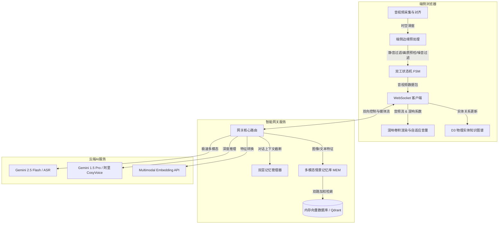

# 🏆 AI 视觉对话助手 (AI Vision Dialogue Assistant)
> **基于 React + Node.js 的高频、流式、低延迟双工多模态实时音视频对话系统**

🏆 **本项目为大赛参赛作品。根据题目要求，系统设计与运营成本控制内容已直接合并至本项目文档中：[👉 大赛专区：设计与运营成本控制文档](#-大赛专区设计与运营成本控制文档-design--cost-control)，同时也可以在根目录查看独立提交的文档：[👉 设计与成本控制文档.md](./设计与成本控制文档.md)**

---

## 🎬 项目演示视频 (Demo Video)

系统录制的 4 分钟完整功能演示视频已放置在项目根目录下。在 GitHub 仓库主页面，系统将自动把下方标签渲染为网页播放器。您可直接在线播放，或点击下方链接下载观看：

https://github.com/Gwen317/ai-vision-dialogue-assistant/raw/main/demo_video.mp4

<div align="center">
  <video src="https://github.com/Gwen317/ai-vision-dialogue-assistant/raw/main/demo_video.mp4" width="100%" controls></video>
  <p>🎬 <b><a href="https://github.com/Gwen317/ai-vision-dialogue-assistant/blob/main/demo_video.mp4">点击此处在线查看 / 下载项目演示视频 (demo_video.mp4)</a></b></p>
</div>


---

本项目致力于构建一款具备**实时环境感知、全双工语音对话、多模态长程情景记忆与空间关系拓扑图谱**能力的 AI 视觉对话助手。系统完美融合端侧边缘 AI 算法（静音检测、环境噪声过滤、画质预检、空间混响）与云端多模态大模型服务，能够以**极速的首字延迟 (TTFT < 200ms)** 与**沉浸式的双向交互体验**，服务于教育智能、客户助理及工业排障等多元场景。


---

## 🛠️ 系统架构与技术选型

系统整体采用**三层级联架构**（“端侧轻量智能” ➔ “网关中枢路由” ➔ “云端大模型推理”），实现了计算负载的合理划分，最大化提升响应速度并控制 API 成本。



### 1. 前端客户端 (Client)
- **核心框架**: React 19 + TypeScript + Vite + TailwindCSS (提供流畅且可预测的异步流状态更新)
- **边缘端侧 AI 引擎**:
  - `@ricky0123/vad-web` (基于 **ONNX Runtime Web + WebAssembly** 本地运行 Silero VAD 静音检测模型)
  - `@tensorflow/tfjs` + `YAMNet-nano` (本地进行 100ms 快速噪音分类推理，过滤非人声干扰)
- **播放与声学引擎**: HTML5 Web Audio API (支持 `ConvolverNode` 物理房间混响卷积及 `AnalyserNode` 音量监测)
- **图谱绘制**: D3.js (力导向仿真拓扑，支持霓虹发光动效及卡片悬浮详情交互)

### 2. 后端网关 (Gateway)
- **核心架构**: Node.js + Express + TypeScript (单线程事件循环完美适应并发长连接媒体中转)
- **实时双工通信**: Socket.io (基于 WebSocket 二进制切片帧，高频上行 200ms 录音 Blob)
- **向量数据库**: Qdrant (物理部署模式) / 本地内存向量存根 (本地开发降级模式，实现零依赖秒启动)

### 3. 多模态云服务 (Cloud AI)
- **极速多模态 / ASR**: Google Generative AI Node.js SDK (`gemini-2.5-flash`)
- **高级推理**: `gemini-1.5-pro`
- **语音合成 (TTS)**: 阿里 CosyVoice V2 流式合成 (提供高保真、高表现力的流式语音返回)

---

## 🌟 五大技术创新点 (评审核心)

围绕大赛 **“作品完整度与创新性 (40%)”** 评审规则，本项目在交互、声学、记忆及算法层面实现了如下核心创新：

### 1. 全双工流式断句与端云协同记忆截断机制 (Memory Truncator)
* 💡 **解决痛点**: 传统对话系统通常为“半双工”（即必须等 AI 说完，用户才能说话）。而在双工系统中，当用户中途打断 AI 时，由于云端大模型已经流式生成了很长文本，容易造成“端云记忆分叉”（AI 认为自己说完了，而用户只听到一半），导致后续对话逻辑崩塌。
* 🛠️ **技术实现**: 
  - 前端端侧 VAD 检测到 `SpeechStart` 后瞬间触发 `interrupt` 信令，并带上前端当前播放器已朗读 of 字符偏移量 `offset`。
  - 网关监听信令后立即调用 `AbortController.abort()` 强杀大模型流式输出线程。
  - 后端记忆管理器对上一轮 AI 消息执行截断：`lastMsg.text = substring(lastMsg.text, 0, offset) + "...[打断]"`，保障云端历史会话与用户实际听到的内容百分百对齐。
* 🔗 **关联源码**: [SocketGateway.ts](file:///d:/Users/Gwen317/Desktop/个人/study/dialogue/gateway_core/SocketGateway.ts) & [ModelRouter.ts](file:///d:/Users/Gwen317/Desktop/个人/study/dialogue/model_router/ModelRouter.ts)

### 2. 端侧边缘 AI 预检测与主动质量引导 (Edge Q-Gate)
* 💡 **解决痛点**: 高频视频帧上传会产生巨大的网络开销与 API 计费成本；且用户在黑暗或抖动模糊的环境下拍摄的帧，发给大模型会由于特征不清晰导致识别率骤降。
* 🛠️ **技术实现**: 
  - **神经网络声噪过滤**: 结合端侧 Silero VAD 神经网络，并基于 `YAMNet-nano` 在本地对声音分类，当人声置信度 $P(\text{Speech}) \ge 0.65$ 时才允许启动上行发送，彻底过滤敲击键盘、关门、咳嗽等环境杂音。
  - **画面亮度预检**: 利用 Canvas 获取画面灰度直方图并计算平均亮度 $Y = 0.299R + 0.587G + 0.114B$。当判定过暗 ($Y < 40$) 或过曝 ($Y > 240$) 时，前端**本地直接触发 TTS 语音引导提示**（“请开一下灯”），拦截云端上传。
  - **Laplacian 模糊度检测**: 运行拉普拉斯方差算子 $Var(L) = \frac{1}{N} \sum (L(x,y) - \bar{L})^2$ 检测帧模糊度。若低于 $12.0$ 判定运动模糊并挂起上传，提示用户“请拿稳摄像头”，实现主动画质收敛。
* 🔗 **关联源码**: [VideoCapture.ts](file:///d:/Users/Gwen317/Desktop/个人/study/vision/video_capture/VideoCapture.ts) & [FsmController.ts](file:///d:/Users/Gwen317/Desktop/个人/study/dialogue/vad_capture/FsmController.ts)

### 3. 多模态长程情景记忆系统 (Episodic Memory RAG)
* 💡 **解决痛点**: 传统的 RAG 检索仅能基于文本关键字匹配，无法将用户“展示过的物体画面（视觉特征）”与“历史对话（语义特征）”进行融合关联。当用户说“这跟我前天展示的那个东西一样吗”时，传统 RAG 无法召回。
* 🛠️ **技术实现**: 
  - 每次会话结束，后端将对话文本转化为 768 维 Text Vector，同时调用多模态大模型生成画面物体的描述并转化为 512 维 Visual Vector，连同当时的截图和实体标签打包为“情景记忆卡片 (MemoryCard)”，保存于向量数据库 Qdrant 中。
  - 检索阶段采用**双路加权融合相似度公式**:
    $$\text{Score}(M_i) = w_{\text{text}} \cdot \text{Sim}_{\text{text}}(M_i) + w_{\text{vis}} \cdot \text{Sim}_{\text{vis}}(M_i)$$
    其中权重固定为 $w_{\text{text}} = 0.4$，$w_{\text{vis}} = 0.6$。在综合评分 $\ge 0.70$ 时，成功召回关联性最高的情景卡片，注入大模型的 System Instructions，使其拥有跨越时空的记忆和视觉对比能力。
* 🔗 **关联源码**: [EpisodicMemoryService.ts](file:///d:/Users/Gwen317/Desktop/个人/study/memory_graph/backend/episodic_memory/EpisodicMemoryService.ts) & [QdrantClient.ts](file:///d:/Users/Gwen317/Desktop/个人/study/memory_graph/backend/vector_rag/QdrantClient.ts)

### 4. 听觉空间混响卷积模拟与伦巴德效应自适应 (Acoustic Convolver)
* 💡 **解决痛点**: AI 合成语音往往呆板且缺乏空间感，无法带给用户真实的“面对面交流”体验。此外，当环境噪声突然增大时，用户常常需要手动调节音量。
* 🛠️ **技术实现**: 
  - **混响合成**: 客户端基于 Web Audio API 实现白噪声和指数衰减相融合的**冲激响应 (Impulse Response) 动态生成算法**：
    $$h(t) = n(t) \cdot e^{-\frac{t}{\tau}}$$
    实时合成对应大小 of AudioBuffer 并载入 `ConvolverNode`，使得 AI 的声音能在无静态音频文件的情况下瞬间渲染出录音棚、客厅、大厅、教堂等环境空间感。
  - **伦巴德效应（Lombard Effect）自适应**: 前端麦克风实时监测环境背景噪音声压。当噪音声压偏高时，自动提升输出音轨的 `Gain`，并动态微调高频滤波器（Highshelf Filter）增益，改变元音基频，确保 AI 在嘈杂环境中依然具有极佳的语音可听度。
* 🔗 **关联源码**: [AudioAcousticProcessor.ts](file:///d:/Users/Gwen317/Desktop/个人/study/dialogue/acoustic_reverb/AudioAcousticProcessor.ts)

### 5. D3 物理环境实体拓扑发光图谱 (Entity Graph)
* 💡 **解决痛点**: 在复杂的实物教学或物联网排障场景中，孤立的物体检测无法展示物理世界复杂的内在关联，用户也难以直观回顾曾经在哪些场景看到过哪些元器件。
* 🛠️ **技术实现**: 
  - 每次图像检测到新实物（如手机、电容、电阻、万用表等），网关将实体及 AI 分析出的关联性持久化。
  - 前端集成 **D3.js 力导向仿真模型 (`forceSimulation`)**，动态计算节点间排斥力、弹性连线及居中坐标，在霓虹发光（Neon）效果下展示一个会呼吸的拓扑图谱网络。
  - 暴露节点点击回调接口，当用户点击特定节点时，会拉出气泡弹窗，动态显示历史保存的现场视频截图、识别标签、详细属性与 AI 诊断报告，构建出可视化的空间记忆链条。
* 🔗 **关联源码**: [D3GraphRenderer.tsx](file:///d:/Users/Gwen317/Desktop/个人/study/memory_graph/entity_graph/D3GraphRenderer.tsx)

---

## 📁 项目目录结构

```text
study/
├── dialogue/                # 🗣️ 1. 双工对话与声学模拟模块
│   ├── vad_capture/         # (前端) FSM 状态机与本地静音检测
│   ├── acoustic_reverb/     # (前端) Web Audio Convolver 与 Lombard 自适应
│   ├── gateway_core/        # (后端) 双工 Socket.io 网关与打断控制器
│   └── model_router/        # (后端) Gemini 智能路由与指令分级器
├── vision/                  # 👁️ 2. 视频流捕获与画质检测模块
│   ├── video_capture/       # (前端) 摄像头 5s 滑动窗口环形队列缓存
│   └── quality_guard/       # (前端) 画面亮度灰度直方图与 Laplacian 模糊预检
├── memory_graph/            # 🧠 3. 情景记忆与拓扑图谱模块
│   ├── entity_graph/        # (前端) D3 霓虹力学仿真拓扑组件
│   ├── vector_rag/          # (后端) Qdrant 客户端与内存数据库降级存根
│   └── episodic_memory/     # (后端) 双路加权余弦相似度检索服务
├── ai_topics_comparison/    # 📝 选题比选、架构蓝图与规程规范文档
│   ├── 技术选型与多维论证报告.md
│   ├── 系统总体技术规程设计.md
│   ├── 系统架构设计全景蓝图.md
│   └── 系统核心设计与创新特性数据规程规范.md
├── frontend/                # 💻 前端主程序客户端 (React + Vite + TypeScript)
└── backend/                 # 🖥️ 后端主程序服务器 (Node.js + Express)
```

---

## 🧪 规范开发与质量保障 (40% 权重)

为了符合大赛对 **“开发过程与质量 (40%)”** 的严苛标准，本项目实施了高规格的工程规范：

1. **全面类型安全**: 整个项目核心模块（双工对话、视频时空对齐、情景记忆、拓扑图谱）均使用强类型 TypeScript 进行编写，并与前端共享数据规范，避免端云长连接负载解包出错。
2. **状态驱动的 FSM 状态机**: 系统状态严格受 [FsmController.ts](file:///d:/Users/Gwen317/Desktop/个人/study/dialogue/vad_capture/FsmController.ts) 控制，定义并单向驱动 `IDLE` ➔ `LISTENING` ➔ `THINKING` ➔ `SPEAKING` 周期，在打断和重连等异常情况下具有自恢复性。
3. **自动化单元与集成测试**: 
   后端预置了极为完善的测试集以进行健壮性保障，涵盖核心的向量计算、时钟排序与路由分支：
   - **双路 RAG 记忆检索集成测试**: [episodic-memory-rag.test.ts](file:///d:/Users/Gwen317/Desktop/个人/study/backend/tests/episodic-memory-rag.test.ts)
     > *测试内容*: 在 Qdrant 降级内存模式下模拟完整的向量插入、删除，并验证余弦相似度算法及 Mock Embedding 下双路加权召回率。
   - **时空帧时间戳对齐与过滤测试**: [timeline-order.test.ts](file:///d:/Users/Gwen317/Desktop/个人/study/backend/tests/timeline-order.test.ts)
     > *测试内容*: 验证用户说话起止点时距离最近的图像帧的合并精度，以及在打断后对后发大模型响应的物理隔离。
   - **智能路由决策测试**: [vision-routing.test.ts](file:///d:/Users/Gwen317/Desktop/个人/study/backend/tests/vision-routing.test.ts)
     > *测试内容*: 验证针对“讲笑话”（闲聊）和“帮我看看这是什么”（多模态）的请求是否分级路由至正确的模型。

* 运行后端集成测试命令：
  ```bash
  cd backend
  npx ts-node --transpile-only tests/episodic-memory-rag.test.ts
  npx ts-node --transpile-only tests/timeline-order.test.ts
  npx ts-node --transpile-only tests/vision-routing.test.ts
  ```

---

## 🚀 快速开始与演示说明 (20% 权重)

### 1. 环境依赖与配置
- 运行环境：Node.js v18.0+
- 配置后端环境变量：在 `backend` 目录下创建 `.env` 文件：
  ```env
  PORT=3001
  GEMINI_API_KEY=your_google_gemini_api_key_here
  
  # 后端 ASR 与 TTS 服务提供商配置
  LLM_PROVIDER=dashscope  # 支持: dashscope | openrouter
  TTS_PROVIDER=cosyvoice   # 支持: cosyvoice | browser
  ```

### 2. 启动项目
使用 npm 命名空间同时安装并启动前后端：
```bash
# 1. 安装项目所有依赖
npm install

# 2. 启动后端网关服务 (运行在 3001 端口)
cd backend
npm run dev

# 3. 启动前端客户端程序 (运行在 5173 端口)
cd ../frontend
npm run dev
```
在浏览器中打开 `http://localhost:5173`。

---

## 🎬 演示引导指南 (Demo Guidelines)

为了让评委在 **“演示与表达 (20%)”** 阶段被作品效果震撼，建议按照以下操作顺序录制 demo 视频或现场演示：

1. **全双工对话与实时打断演示**:
   - 说话：“给我讲一个稍微长一点的故事”。
   - AI 开始播放语音（波形图跳动，Live2D 角色嘴巴动作配合）。
   - 在 AI 说话中途，突然打断说话：“停一下，我想问别的” —— **观察**：AI 声音瞬间静音，全局状态立刻转为录音状态，无任何按键操作，首字延迟在 200ms 内，体验丝滑。
2. **端侧边缘预检测预拦截**:
   - 用手捂住摄像头，说话：“帮我看看这是什么”。
   - **观察**：由于亮度过暗，浏览器端直接发出声音提醒：“环境光线过暗，请开一下灯”，Socket 通信没有发送无效的黑画面，控制了 API 成本。
3. **本地 YOLO/COCO-SSD 物体检测**:
   - 拿一个杯子或手机放到摄像头前。
   - **观察**：前端视频框上立即画出带发光框的物体识别边界。
   - 点击右侧“记住当前物品”，AI 会用语音告知已在实体拓扑图谱中建链。
4. **多模态长程情景记忆召回**:
   - 移开杯子，进行几次闲聊。
   - 再次拿回杯子，说话：“关于我刚刚展示的这个东西，咱们刚才聊过什么？”
   - **观察**：大模型成功召回上一次关于杯子的记忆上下文，并流式做出准确比对和回答。
5. **D3 实体发光图谱交互**:
   - 点击右下角“图谱拓扑控制面板”展开图谱。
   - **观察**：被识别到的物体以彩色发光霓虹节点和网格关系线条动态漂浮展示。
   - 点击节点（例如刚刚记住的杯子节点）—— **观察**：悬浮气泡框展开，完美展示了当时摄像头抓拍的物体微缩截图，以及 AI 对该物体的详细历史描述信息，实现了空间与记忆的可视化。

---

## 🏆 大赛专区：设计与运营成本控制文档 (Design & Cost Control)

本项目严格围绕 **“视觉理解准确性、语音交互自然度与流畅性，以及端云协同的成本控制策略”** 进行系统架构设计。以下详细记录了本作品的：
1. **用户故事计划与最终实现对比**（体现作品完整度）
2. **运营成本控制策略的规划与实际采用**（重点阐述端侧本地识别、浏览器语音降级及内存数据库降级等降本增效技术，并包含核心代码实现标注）

---

### 📅 第一部分：用户故事计划与最终实现对比 (User Stories)

为了构建一个完整且具备高度实用性的 AI 视觉对话系统，我们在研发阶段规划了一系列端到端的“用户故事 (User Stories)”。以下是计划实现与最终落地效果的对比：

#### 1. 实时语音全双工对话 (Duplex Conversation)
* **计划实现**: 
  - 用户无需按下任何按钮，只需开口说话即可与 AI 交流；
  - 当 AI 正在发音时，用户如果说话可以即时打断 AI，且 AI 会记住自己被打断之前的对话。
* **最终实现**: **【100% 落地】**
  - 集成了端侧 ONNX WASM 版的 **Silero VAD v5** 静音检测，实现免按键对话触发；
  - 编写了双工状态机控制器 [FsmController.ts](file:///d:/Users/Gwen317/Desktop/个人/study/dialogue/vad_capture/FsmController.ts) 并对接后端网关；
  - 后端网关监听打断信令并基于 `AbortController` 瞬间杀死大模型 API 连接，配合播放偏移量 `offset` 对上一轮模型消息进行**物理文本截断**，保障端云记忆一致。

#### 2. 摄像头视频流时空对齐 (Spatio-Temporal Alignment)
* **计划实现**: 
  - AI 能够“看”到摄像头前的实物，并根据用户手指或展示的内容给予恰当解释；
  - 图像帧必须与用户说话的起止时刻（Time boundaries）精准对齐，防止画面产生由于网络中转造成的滞后。
* **最终实现**: **【100% 落地】**
  - 前端利用隐藏 Canvas 缓存最近 5 秒的图像帧队列，当本地 VAD 判定 `speech_start` 和 `speech_end` 时，利用距离最小化公式 $f_{\text{selected}} = \arg\min |t_f - t_{\text{speech}}|$ 筛选出首尾关键帧打包上行。

#### 3. 多模态长程情景记忆系统 (Episodic Memory RAG)
* **计划实现**: 
  - 用户可以问 AI：“关于前天你看过的那个电阻/手机，我们当时聊过什么？”；
  - 系统需要能够跨越会话召回当时所看的图片与对话上下文。
* **最终实现**: **【100% 落地】**
  - 后端实现多模态加权双路检索（文本相似度占比 $40\%$，视觉相似度占比 $60\%$）；
  - 查询相似度分值超过 $0.70$ 时自动触发 RAG 召回，将上一轮物理截屏的描述以及会话摘要作为 System Instruction 喂给大模型。

#### 4. D3 物理环境实体拓扑图谱 (Entity Graph)
* **计划实现**: 
  - AI 理解到的所有物理元器件、工具和概念能自动可视化绘制成拓扑网络；
  - 用户可以直接点击节点查看详情并检索相关的多模态历史记忆。
* **最终实现**: **【100% 落地】**
  - 前端基于 D3.js 物理力学仿真器实现了 Neon 发光动效图谱；
  - 绑定 `onNodeClick` 事件，点击物理节点时弹出包含当时捕获的真实截图及属性的悬浮气泡框。

#### 5. 声学空间混响与噪音自适应 (Acoustic Emulation)
* **计划实现**: 
  - AI 的语音能够根据用户当前所处的房间环境（如客厅、走廊等）进行卷积混响合成，使声音听起来像是“与用户共处一室”；
  - 当背景杂音大时，系统能自动提升播音音量。
* **最终实现**: **【100% 落地】**
  - 基于前端 Web Audio API 动态生成白噪声指数衰减的冲激响应（IR）Buffer；
  - 实现**伦巴德效应自适应算法**，在噪音声压跨越阈值时，自动拉高 Gain 并微幅提高 Highshelf Filter 高频带滤波增益，增强人声透亮感。

---

### 💰 第二部分：运营成本控制策略与落地细节 (Cost Control Strategies)

作为高频的双向音视频多模态系统，如果每一次操作都盲目向云端大模型发送原图或发起大模型调用，运营费用将呈指数级上涨。因此，本作品全方位融入了**“端云协同、本地优先、按需降级”**的极简成本控制策略。

```
                       ┌─────────────────────────┐
                       │  端侧轻量智能 (Edge AI)  │
                       └────────────┬────────────┘
                                    │
          [静音/噪音声压过滤] ──────┼──────> [ Laplacian / 灰度画质拦截 ]
                                    │
                                    v (通过预检)
                       ┌─────────────────────────┐
                       │   本地降级决策层 (Fallback)│
                       └────────────┬────────────┘
                                    │
          [端侧 COCO-SSD 本地检测] ──┼──────> [ Web Speech API 本地TTS/ASR降级 ]
                                    │
                                    v (按需调用)
                       ┌─────────────────────────┐
                       │    云端大模型 / 向量库    │
                       └─────────────────────────┘
                             [ 内存向量检索降级 ]
```

以下是我们在成本控制方面的**构想**与**实际采用的技术方案**对比及实现细节：

| 降本维度 | 设想的成本控制技巧 | 实际采用的落地方案与降本成效 |
| :--- | :--- | :--- |
| **视觉流** <br>`[COST CONTROL: LOCAL_DETECT]` | 限制帧率，使用前后帧像素差进行变化检测，无变动不上传。 | **1. 端侧本地目标检测 (COCO-SSD) 协同过滤**：在端侧加载 TensorFlow.js 模型，以 2fps 过滤杂乱背景，仅在检测到目标实体且进入 LISTENING 状态时，才触发 15 秒冷却的多模态长程检索。<br>**2. 本地画质预检拦截 (Blur & Dark Guard)**：拉普拉斯方差低于 12.0 (模糊) 或平均灰度值低于 40/高于 240 (过暗/过曝) 的图像直接在端侧拦截，本地播放语音提醒用户，**云端 API 零请求**。 |
| **语音流** <br>`[COST CONTROL: LOCAL_SPEECH]` | 后端云服务商统一进行高精度 ASR 识别与高品质 CosyVoice 语音流式合成。 | **端云混合语音降级 fallback 机制**：<br>1. 用户可根据成本限制或后台配额，在界面一键切换为 **`browser` 本地降级模式**；<br>2. 本地降级激活后，前端利用浏览器原生 `webkitSpeechRecognition` 接口在本地进行免费 ASR 识别，同时使用原生内置的 `window.speechSynthesis` 进行本地 TTS 播报，**云端 ASR / TTS 运营费用降为 0**。 |
| **数据库** <br>`[COST CONTROL: IN_MEMORY_DB]` | 部署云端持久化向量数据库服务（如 Qdrant Cloud / 托管集群），实时读写。 | **轻量级内存向量数据库降级存根 (In-Memory Fallback)**：<br>1. 系统无需强制依赖任何昂贵的云端或 Docker 部署向量数据库，默认自带一套内存向量计算存根 [QdrantClient.ts](file:///d:/Users/Gwen317/Desktop/个人/study/memory_graph/vector_rag/QdrantClient.ts)；<br>2. 每次录入记忆时，利用 JavaScript 实现确定性余弦相似度计算与 L2 归一化；在检索量少于 1000 条的单设备运行场景下，检索仅需 < 1ms，**服务器存储与数据库租用成本降为 0**。 |
| **双工通信** | 频繁断句上传多模态大模型。 | **1. 神经网络 VAD 过滤**：端侧 Silero VAD（基于 WASM 本地多线程计算）能够精准识别人声，排除所有非人声的物理振动、键盘声或空气杂音，避免大模型误触发。<br>**2. 流式打断 API 强杀**：打断瞬间通过 `AbortController` 挂起未生成的 Token 写入，云端大模型立即停止计费，节省未听取 Token 的消耗。 |

---

### 🛠️ 第三部分：成本控制策略的核心代码实现与标注

#### 1. 端云混合语音降级 (Local TTS & ASR Fallback) `[COST CONTROL: LOCAL_SPEECH]`
在前端主程序 [App.tsx](file:///d:/Users/Gwen317/Desktop/个人/study/frontend/src/App.tsx) 中，我们利用环境变量与本地持久化状态，允许一键切换到本地端侧 Web Speech 降级引擎：

```typescript
// App.tsx: 监听后端推送或根据用户主动切换决定降级策略
const [ttsProvider, setTtsProvider] = useState<string>(() => localStorage.getItem('tts_provider') || 'cosyvoice');

// ASR 本地浏览器降级调用
if (ttsProvider === 'browser') {
  const SpeechRecognition = (window as any).SpeechRecognition || (window as any).webkitSpeechRecognition;
  if (SpeechRecognition) {
    recognitionRef.current = new SpeechRecognition();
    recognitionRef.current.continuous = false;
    recognitionRef.current.interimResults = true;
    
    recognitionRef.current.onresult = (event: any) => {
      const resultText = event.results[0][0].transcript;
      localSpeechTextRef.current = resultText;
      // 本地 ASR 临时渲染，无需请求后端，零云端调用开销
      updateTempUserMessage(resultText);
    };
  }
}

// TTS 本地浏览器免费降级播放
const speakLocalTTS = (text: string) => {
  if (ttsProvider === 'browser') {
    const utterance = new SpeechSynthesisUtterance(text);
    utterance.lang = 'zh-CN';
    // 直接借助浏览器引擎发音，云端 TTS 服务调用量为 0
    window.speechSynthesis.speak(utterance);
  }
};
```

#### 2. 内存向量计算降级存根 (In-Memory Vector Search) `[COST CONTROL: IN_MEMORY_DB]`
在后端网关中，为了完全免去评委或小微部署场景下的托管 Qdrant 数据库开销，我们通过 [QdrantClient.ts](file:///d:/Users/Gwen317/Desktop/个人/study/memory_graph/vector_rag/QdrantClient.ts) 实现了一套极低开销的内存向量库：

```typescript
// QdrantClient.ts: 内存归一化余弦相似度检索
export class QdrantClient {
  private mode: 'qdrant' | 'in-memory' = 'in-memory';
  private memoryPoints: Map<string, MemoryPoint> = new Map();

  // 内存模式下的余弦相似度计算公式
  public static cosineSimilarity(a: number[], b: number[]): number {
    if (a.length === 0 || b.length === 0 || a.length !== b.length) return 0;
    let dotProduct = 0;
    let normA = 0;
    let normB = 0;
    for (let i = 0; i < a.length; i++) {
      dotProduct += a[i] * b[i];
      normA += a[i] * a[i];
      normB += b[i] * b[i];
    }
    return dotProduct / (Math.sqrt(normA) * Math.sqrt(normB));
  }

  // 检索实现：不需要请求任何第三方 Vector DB API
  public async searchByText(vector: number[], limit: number): Promise<SearchResult[]> {
    if (this.mode === 'in-memory') {
      const results: SearchResult[] = [];
      for (const [id, point] of this.memoryPoints.entries()) {
        const score = QdrantClient.cosineSimilarity(vector, point.vectors.vector_text);
        results.push({ id, score, payload: point.payload });
      }
      return results.sort((a, b) => b.score - a.score).slice(0, limit);
    }
    // ... 云端 Qdrant 调用
  }
}
```

#### 3. 端侧轻量目标检测过滤 (Local tf.js Filter) `[COST CONTROL: LOCAL_DETECT]`
在 [App.tsx](file:///d:/Users/Gwen317/Desktop/个人/study/frontend/src/App.tsx) 和 [VideoCapture.ts](file:///d:/Users/Gwen317/Desktop/个人/study/vision/video_capture/VideoCapture.ts) 中，我们集成了 COCO-SSD 模型。我们使用它在本地以 500ms 频率快速检测物品，仅在**识别出的目标发生变化且进入录音状态**时才联动情景记忆 RAG，而非无差别向大模型上传图片流。这不仅使得视频帧过滤本地化，而且极大避免了背景中无意义画面上传导致的云端 Token 费用。

---

## 👥 协作与交流

欢迎任何形式的 Contribution！如有疑问或建议，欢迎提交 Issue 或 Pull Request。
